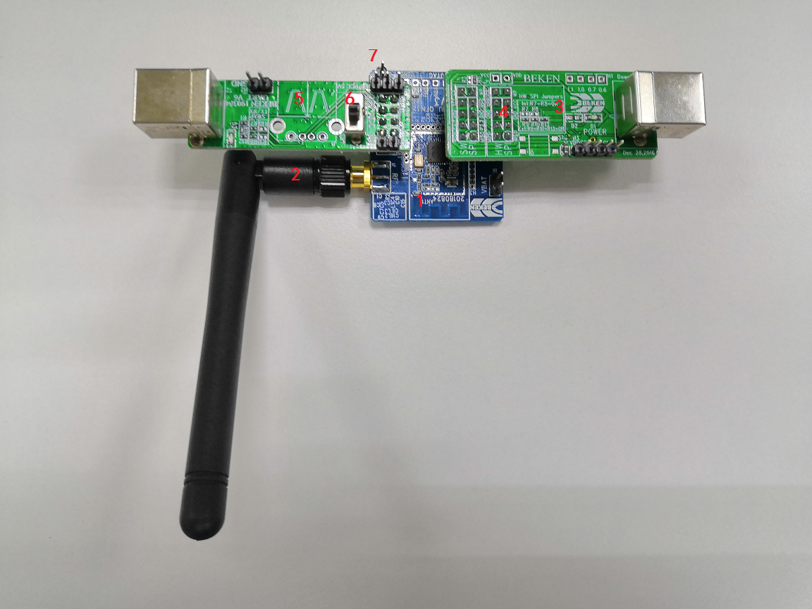
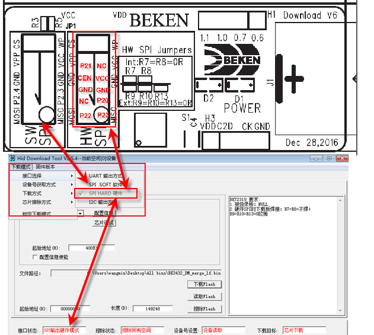
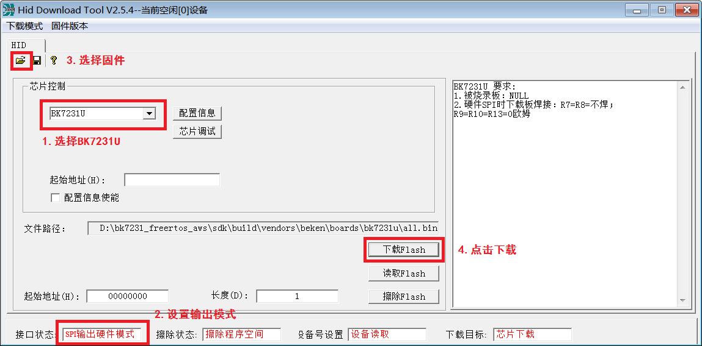
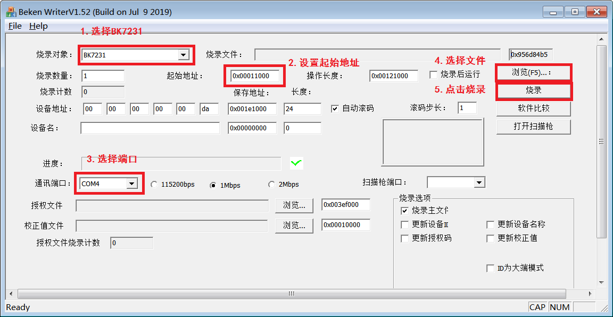
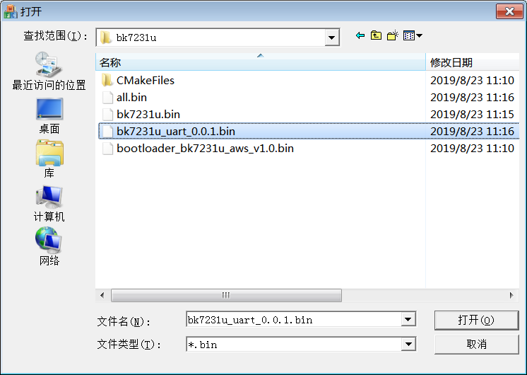
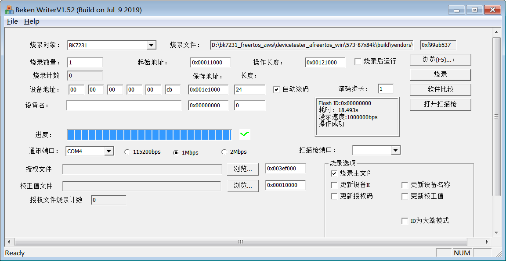

# BK7231U Startup

EN | [中文](./README_zh.md)


> This port uses a version of FreeRTOS kernel that has been modified by Beken Corporation. For any questions and support requests please contact Beken Corporation <<contact info from the DQP listing >>.


## Compile

#### Setup Environment

- Install CMake and make sure the version of CMake great than 3.13

- Install make (MingW or GNU Make) and add the path of make.exe to the `PATH` environment variable
- Install arm gcc, compile based on `arm gcc windows` version, such as `gcc-arm-none-eabi-5_4-2016q3-20160926-win32.exe`, add `gcc` path to `PATH` environment variable after the installation is successful.


#### Compile Firmware

There are two mode for compiling in AWS FreeRTOS SDK,  test mode and example mode. In `sdk`  directory, run the following command to compile the sample project.


`cmake -DVENDOR=beken -DBOARD=bk7231u -DCOMPILER=arm-gcc -DAFR_ENABLE_TESTS=0 -S. -Bbuild -G"Unix Makefiles"`


Run the following command to compile the test project (eg IDT)

`cmake -DVENDOR=beken -DBOARD=bk7231u -DCOMPILER=arm-gcc -DAFR_ENABLE_TESTS=1 -S. -Bbuild -G"Unix Makefiles"`


> You could modify and run  `generate_make.bat` directly, and the batch will generate the sample project's Makefile by default.


#### Update Firmware

There are three ways to update firmware, including SPI burning, UART upgrade, OTA upgrade. Before introducing update formware, please understand the wiring of BK7231U：



description:

1. BK7231U chip
2. External antenna
3. SPI download board, download whole firmware
4. software / hardware SPI socket on SPI download board, using hardware SPI socket on usual, since it would be faster
5. UART serial board, download application firmware, using UART2 to download and debug as default
6. Power switch, circuit board marked ON and OFF for switching
7. Power select: could be 3.3V/5V, the default is 3.3V, the EVB using 3.3V


##### SPI Burning

Run `projects\beken\tools\BKHidToolv2.5.2.exe` and  select `build\vendors\beken\boards\bk7231u\all.bin`，`all.bin` contain `bootloader` and `application` firmware.

The 3 in the figure above is the SPI download board. The figure below is an enlarged view. The upper part of the figure is the hardware interface. There are two interfaces in the download board ("SW SPI" and "HW SPI"). The BK7231U recommends "HW". SPI", the box P20, P21, P22, P23, CEN corresponds to the corresponding PIN pin of the BK7231U chip, and the demo board can be inserted according to Figure 1. In the upper computer corresponding to the hardware (lower part of the figure below), you need to check “SPI HARD hardware” as shown in the figure, and the current selection status will be displayed in the lower left corner of the software. If the "SW SPI" is inserted in the download board, the host computer should select "SPI SOFT Software".




After completing the hardware connection, complete the firmware download according to the prompts in the figure below.



##### UART Upgrade

If the board already has `bootloader` (for example: you have already burned the firmware via SPI), you could use `projects\beken\tools\bk_writer_V1.45_20180909_2M.exe` and select `build\vendors\beken\boards\bk7231u\bk7231u_uart_*.bin`




Select the file in step 4, and the UART upgrade file compiled by make is named `bk7231u_uart_0.0.1.bin` at present.




After step 5 is completed, the operation will be successful. Otherwise, please re-burn it. When the programming is started, the development board will be reset automatically. If it is not reset successfully (the operation will time out), you can manually reset the development board after clicking Burn.




Description of the parameters  bk_writer when running in command mode

```bat
start /wait bk_writer_V1.52_20190909.exe -tBK7231 -pCOM4@1000000 -fbk7231u_uart_0.0.1.bin@00011000 -e2

echo bk_writer return %errorlevel%
```

Description of `errorlevel`

```c
ERR_CODE_Success=1,//success
ERR_CODE_General=0,//the port is busy or not exist
ERR_CODE_Read=-1,//read flash failure
ERR_CODE_UnProtect=-2,//unprotect flash failure
ERR_CODE_EraseFlash=-3,//erase flash failure
ERR_CODE_WriteFlash=-4,//write flash failure
ERR_CODE_WriteCfg=-5,//write config failure
ERR_CODE_WriteSec0=-6,//write sector0 failure
ERR_CODE_Verify=-7,//verify failure
ERR_CODE_Protect=-8,//protect flash failure
ERR_CODE_CAP_BUS=-9,//the bus is busy
ERR_CODE_SET_BR=-10,//set baud rate failure

```


#### IDT Setup

Please modify configure file of IDT before startup

- `devicetester_afreertos_win\configs\userdata.json`

```json
{
  "sourcePath": "<C:/absolute-path-to/amazon-freertos>",   //the path of source
  ...
  "clientWifiConfig": {
    "wifiSSID": "<ssid>",
    "wifiPassword": "<passwd>",
    "wifiSecurityType": "eWiFiSecurityOpen | eWiFiSecurityWEP | eWiFiSecurityWPA | eWiFiSecurityWPA2"
  },
  "testWifiConfig": {
    "wifiSSID": "<ssid>",
    "wifiPassword": "<passwd>",
    "wifiSecurityType": "eWiFiSecurityOpen | eWiFiSecurityWEP | eWiFiSecurityWPA | eWiFiSecurityWPA2"
  },
  ...
}
```

- `devicetester_afreertos_win\configs\device.json`

```json
[
  {
    ...
    "devices": [
      {
        "id": "bk-c8934844aae8",
        "connectivity": {
          "protocol": "uart",
          "serialPort": "COM4"               //the port of serial
        },
        "identifiers": [
          {
            "name": "serialNo",
            "value": "4"                     //the port of serial
          }
        ]
      }
    ]
  }
]
```

