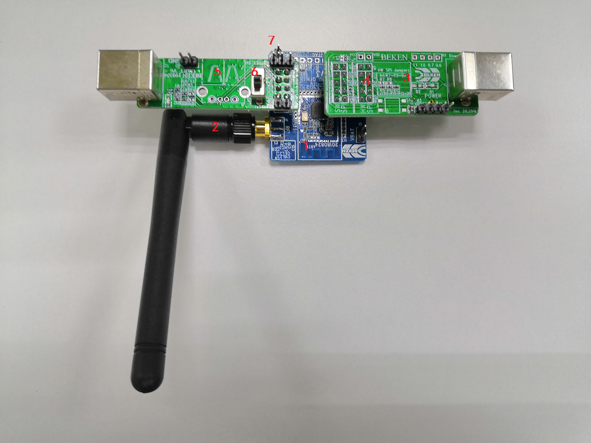
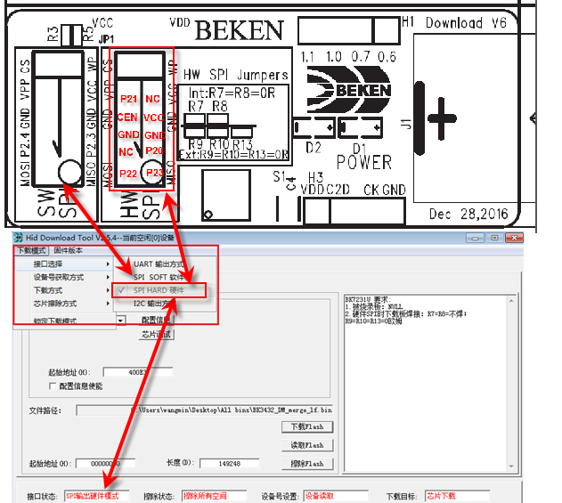
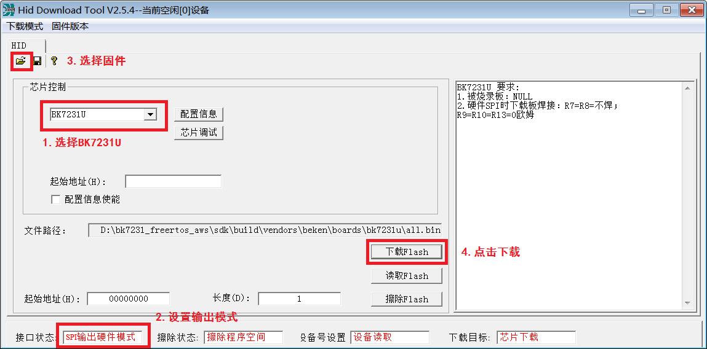
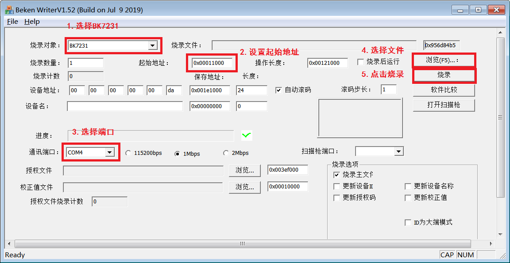
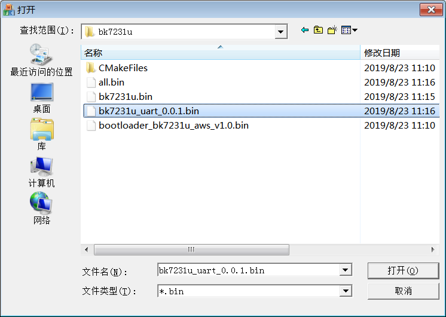
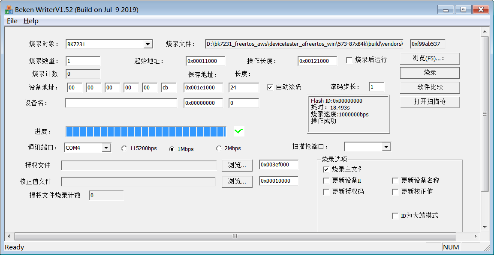

# BK7231U Startup

## 编译

#### 搭建环境

编译基于`arm gcc windows`版本，比如`gcc-arm-none-eabi-5_4-2016q3-20160926-win32.exe`，安装成功后，将`gcc`路径加入`PATH`环境变量即可。

#### 编译固件

AWS FreeRTOS的编译包含测试和示例两种模式，在工程sdk目录下，运行如下命令可以编译示例工程

`cmake -DVENDOR=beken -DBOARD=bk7231u -DCOMPILER=arm-gcc -DAFR_TOOLCHAIN_PATH=D:/zhangheng/tools/env/tools/gnu_gcc/arm_gcc/mingw -S. -Bbuild -G"Unix Makefiles"`

运行如下命令可以编译测试工程（如：IDT）

`cmake -DVENDOR=beken -DBOARD=bk7231u -DCOMPILER=arm-gcc -DAFR_ENABLE_TESTS=1 -DAFR_TOOLCHAIN_PATH=D:/zhangheng/tools/env/tools/gnu_gcc/arm_gcc/mingw -S. -Bbuild -G"Unix Makefiles"`

> 也可以修改并运行批处理文件`bk7231_freertos_aws\sdk\generate_make.bat`，批处理默认生成示例工程的Makefile

#### 更新固件

固件的更新有三种方式，包括SPI烧录、UART升级、OTA升级，在介绍更新前，先了解一下BK7231U的接线，如下图：

BK7231U芯片与UART、SPI的连接图如上所示，其中：

1. BK7231U芯片
2. 外接天线
3. 专用SPI下载口，下载完整Flash程序
4. SPI下载板上的软/硬件SPI接口，一般用板里面那一组硬件SPI，速度稍快
5. UART2下载和测试口，下载Flash应用程序
6. 供电开关，电路板有标注ON和OFF
7. 供电接口：VCC连目标BK7231U模块板电源，可连3.3V/5V，默认为3.3V

##### SPI烧录

运行`bk7231_freertos_aws\sdk\projects\beken\tools\BKHidToolv2.5.2.exe`并选择`bk7231_freertos_aws\sdk\build\vendors\beken\boards\bk7231u\all.bin`，`all.bin`带`bootloader`和`bk7231u`固件

上图中的3即为SPI下载接口，下图为放大图，图中上半部分为硬件接口，下载板中有两个接口(”SW SPI”和”HW SPI”)，BK7231U推荐用”HW SPI”，框中P20，P21，P22，P23，CEN对应BK7231U芯片的对应PIN脚，按图1插入演示板即可。与硬件相对应的上位机中（下图下半部分）需要如图所示勾选“SPI HARD 硬件”，在软件左下脚会显示当前选择状态。如果下载板插了”SW SPI”，则上位机要选”SPI SOFT软件”。

完成硬件连接后，根据下图中的提示完成固件下载

##### UART升级

如果已经有`bootloader`（例如：已经通过SPI烧录过固件），可以使用`bk7231_freertos_aws\sdk\projects\beken\tools\bk_writer_V1.45_20180803_2M.exe`并选择`bk7231_freertos_aws\sdk\build\vendors\beken\boards\bk7231u\bk7231u_uart_*.bin`

步骤4中选择文件，当前脚本编译出来的UART升级文件名为`bk7231u_uart_0.0.1.bin`

步骤5完成后会提示操作成功，如果未成功请重新烧录，烧录时会自动复位开发板，如果未复位成功（会显示操作超时），可以在点击烧录后手动复位开发板

