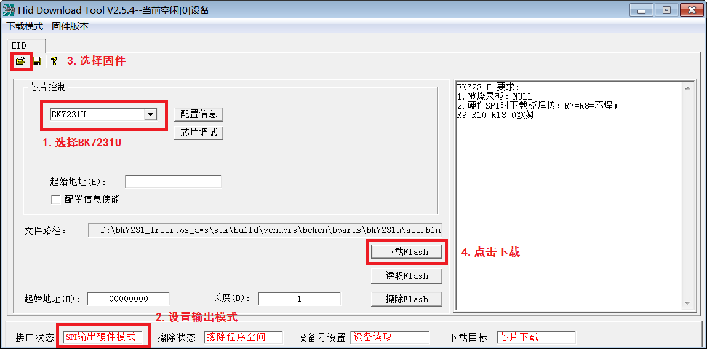
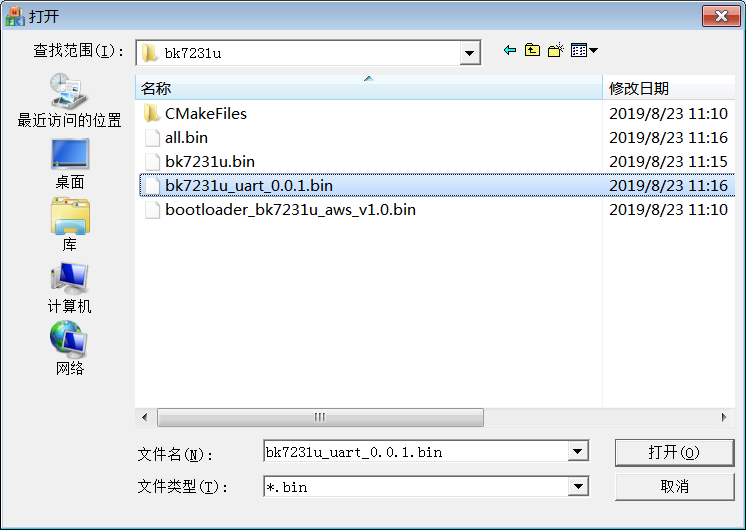
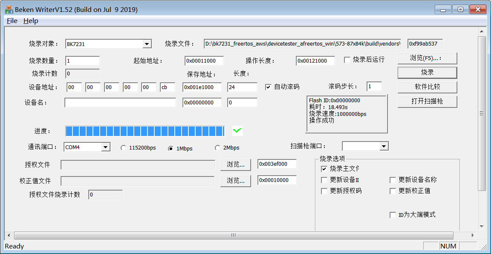

# BK7231U Startup

[EN](./README.md) | 中文


> This port uses a version of FreeRTOS kernel that has been modified by Beken Corporation. For any questions and support requests please contact Beken Corporation <<contact info from the DQP listing >>.


## 编译

#### 搭建环境

- 安装CMake，并确保CMake版本不低于3.13
- 安装make（MingW或者GNU Make），并将make.exe所在路径添加到`PATH`环境变量
- 安装arm gcc，编译基于`arm gcc windows`版本，比如`gcc-arm-none-eabi-5_4-2016q3-20160926-win32.exe`，安装成功后，将`gcc`路径加入`PATH`环境变量即可。


#### 编译固件

AWS FreeRTOS的编译包含测试和示例两种模式，在工程sdk目录下，运行如下命令可以编译示例工程


`cmake -DVENDOR=beken -DBOARD=bk7231u -DCOMPILER=arm-gcc -DAFR_ENABLE_TESTS=0 -S. -Bbuild -G"Unix Makefiles"`


运行如下命令可以编译测试工程（如：IDT）

`cmake -DVENDOR=beken -DBOARD=bk7231u -DCOMPILER=arm-gcc -DAFR_ENABLE_TESTS=1 -S. -Bbuild -G"Unix Makefiles"`


> 也可以修改并运行批处理文件`generate_make.bat`，批处理默认生成示例工程的Makefile


#### 更新固件

固件的更新有三种方式，包括SPI烧录、UART升级、OTA升级，在介绍更新前，先了解一下BK7231U的接线，如下图：


BK7231U芯片与UART、SPI的连接图如上所示，其中：

1. BK7231U芯片
2. 外接天线
3. 专用SPI下载板，下载完整固件
4. SPI下载板上的软/硬件SPI接口，一般用板里面那一组硬件SPI，速度稍快
5. UART串口板，缺省使用UART2下载和串口调试，下载应用固件
6. 供电开关，电路板有标注ON和OFF
7. 供电选择：可选择3.3V/5V，默认为3.3V，当前EVB使用3.3V供电


##### SPI烧录

运行`projects\beken\tools\BKHidToolv2.5.2.exe`并选择`build\vendors\beken\boards\bk7231u\all.bin`，`all.bin`带`bootloader`和`bk7231u`固件

上图中的3即为SPI下载接口，下图为放大图，图中上半部分为硬件接口，下载板中有两个接口(”SW SPI”和”HW SPI”)，BK7231U推荐用”HW SPI”，框中P20，P21，P22，P23，CEN对应BK7231U芯片的对应PIN脚，按图1插入演示板即可。与硬件相对应的上位机中（下图下半部分）需要如图所示勾选“SPI HARD 硬件”，在软件左下脚会显示当前选择状态。如果下载板插了”SW SPI”，则上位机要选”SPI SOFT软件”。


完成硬件连接后，根据下图中的提示完成固件下载



##### UART升级

如果已经有`bootloader`（例如：已经通过SPI烧录过固件），可以使用`projects\beken\tools\bk_writer_V1.45_20180803_2M.exe`并选择`build\vendors\beken\boards\bk7231u\bk7231u_uart_*.bin`


步骤4中选择文件，当前脚本编译出来的UART升级文件名为`bk7231u_uart_0.0.1.bin`




步骤5完成后会提示操作成功，如果未成功请重新烧录，烧录时会自动复位开发板，如果未复位成功（会显示操作超时），可以在点击烧录后手动复位开发板




关于bk_writer命令行启动的参数及返回值说明

```bat
start /wait bk_writer_V1.52_20190909.exe -tBK7231 -pCOM4@1000000 -fbk7231u_uart_0.0.1.bin@00011000 -e2

echo bk_writer return %errorlevel%
```

返回值`errorlevel`涵义

```c
ERR_CODE_Success=1,//成功
ERR_CODE_General=0,//串口被占用或不存在
ERR_CODE_Read=-1,//flash读取失败
ERR_CODE_UnProtect=-2,//flash解保护失败
ERR_CODE_EraseFlash=-3,//flash擦除失败
ERR_CODE_WriteFlash=-4,//flash写sector失败
ERR_CODE_WriteCfg=-5,//写config失败
ERR_CODE_WriteSec0=-6,//写sector0失败
ERR_CODE_Verify=-7,//校验失败
ERR_CODE_Protect=-8,//flash加保护失败
ERR_CODE_CAP_BUS=-9,//抢总线失败
ERR_CODE_SET_BR=-10,//设置串口波特率失败

```


#### IDT测试

在启动IDT测试前，请修改如下文件

- `devicetester_afreertos_win\configs\userdata.json`

```json
{
  "sourcePath": "<C:/absolute-path-to/amazon-freertos>",   //the path of source
  ...
  "clientWifiConfig": {
    "wifiSSID": "<ssid>",
    "wifiPassword": "<passwd>",
    "wifiSecurityType": "eWiFiSecurityOpen | eWiFiSecurityWEP | eWiFiSecurityWPA | eWiFiSecurityWPA2"
  },
  "testWifiConfig": {
    "wifiSSID": "<ssid>",
    "wifiPassword": "<passwd>",
    "wifiSecurityType": "eWiFiSecurityOpen | eWiFiSecurityWEP | eWiFiSecurityWPA | eWiFiSecurityWPA2"
  },
  ...
}
```

- `devicetester_afreertos_win\configs\device.json`

```json
[
  {
    ...
    "devices": [
      {
        "id": "bk-c8934844aae8",
        "connectivity": {
          "protocol": "uart",
          "serialPort": "COM4"               //the port of serial
        },
        "identifiers": [
          {
            "name": "serialNo",
            "value": "4"                     //the port of serial
          }
        ]
      }
    ]
  }
]
```

